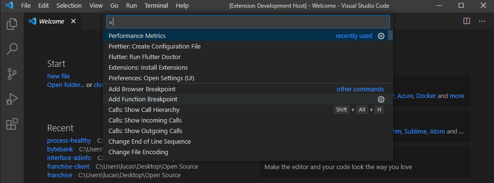

# Performance Metrics

This extension has the purpose to show CPU and RAM usage.

## Features

Active the extension using "Perfomance Metrics" command at the vscode command pallet.

Metrics will be shown at the bottom at the Status Bar.

## Requirements

This extension uses node-os-utils and os node's packages.

## Release Notes

### 1.0.0

Initial release.

